# My Portfolio

> Assignment for My Portfolio

This is a simple personal website of **Nofrialdi** made using HTML and CSS.

## Links/URLs

1. Link Github Pages :<https://revou-fsse-1.github.io/w4-my-portfolio-nofrialdi/>
2. Link Netlify : <https://w4-my-portfolio.netlify.app/>
3. Link Domainersia :<https://week4.nofri.xyz/>

## Documentation

  
Deploy project to Netlify

<main class="content">
  
1. Open netlify.com in your browser
   

2. Register Netlify
   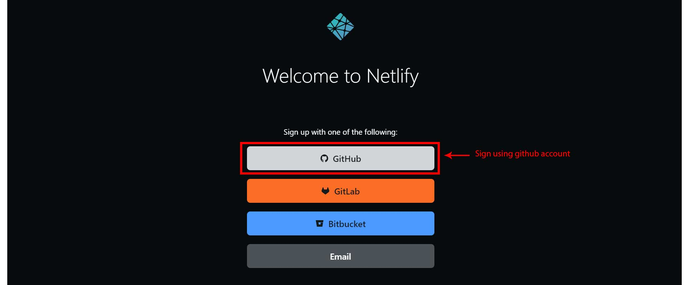

3. Sign in to GitHub to continue to Netlify Auth
   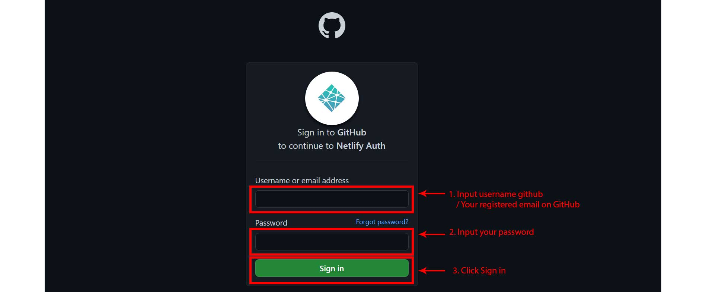

4. Add site
   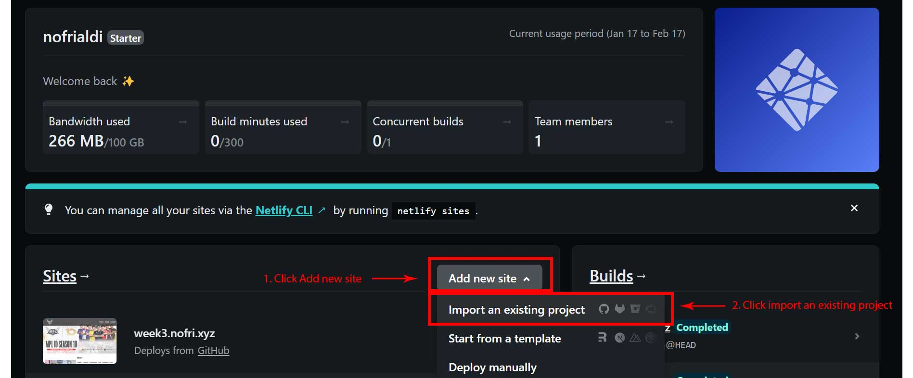

5. Import an existing project from a Git repository
   

6. Connect to Git provider
   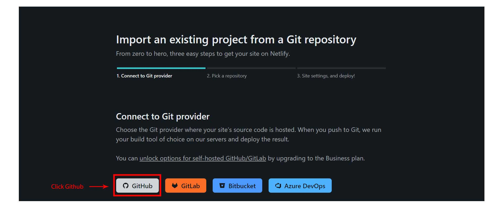

7. Pick a repository from GitHub
   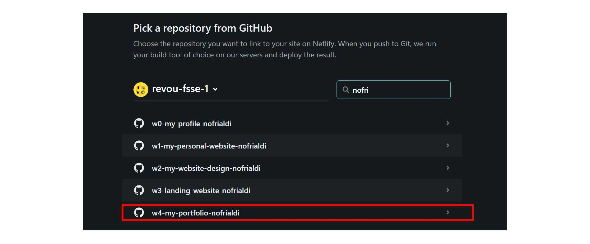

8. Deploy site
   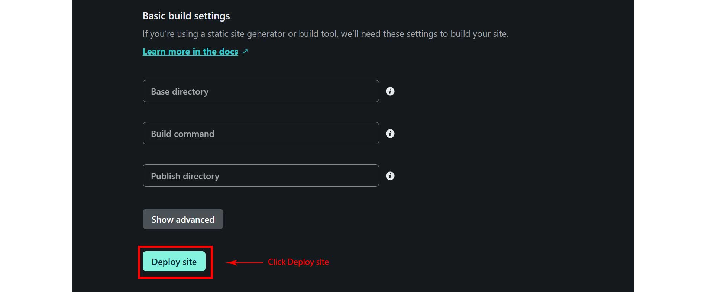

9. Domain setting
   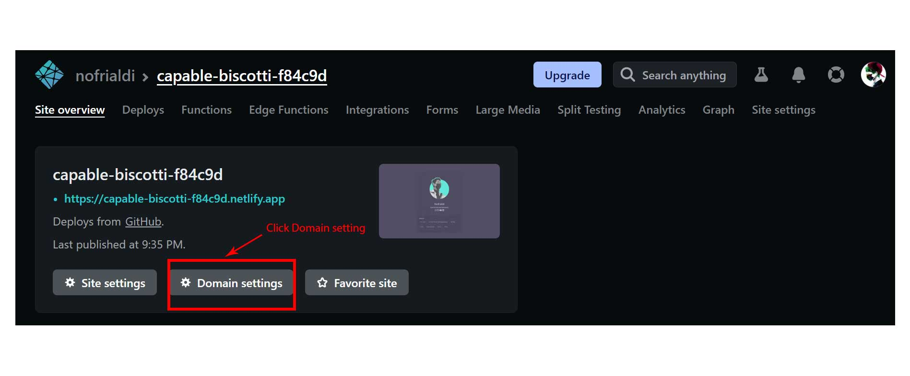

10. Edit site name
    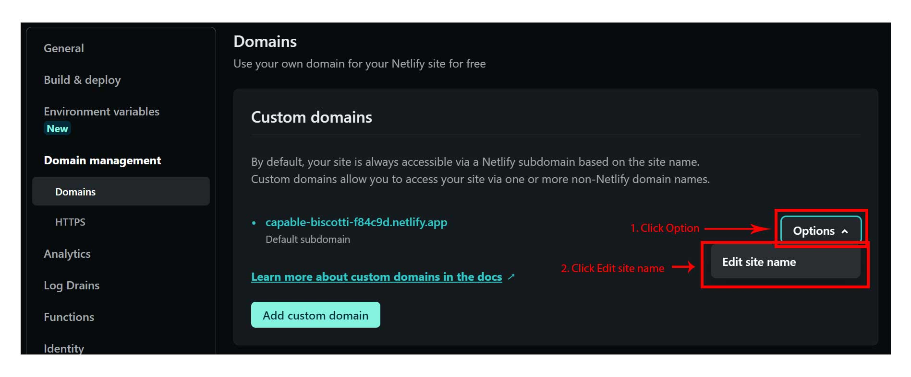

11. Change site name
    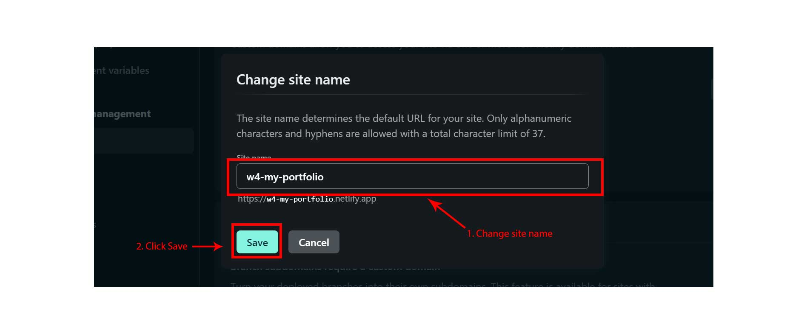

12. Go to site
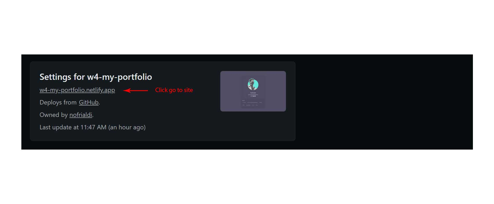
</main>

  
Custom domain using DomaiNesia

<main class="content">
  
1. Open Domainesia.com
   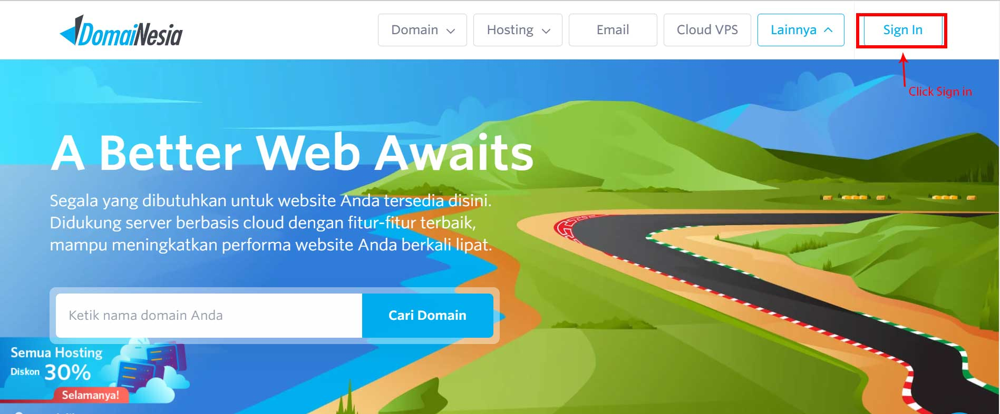

2. Sign in
   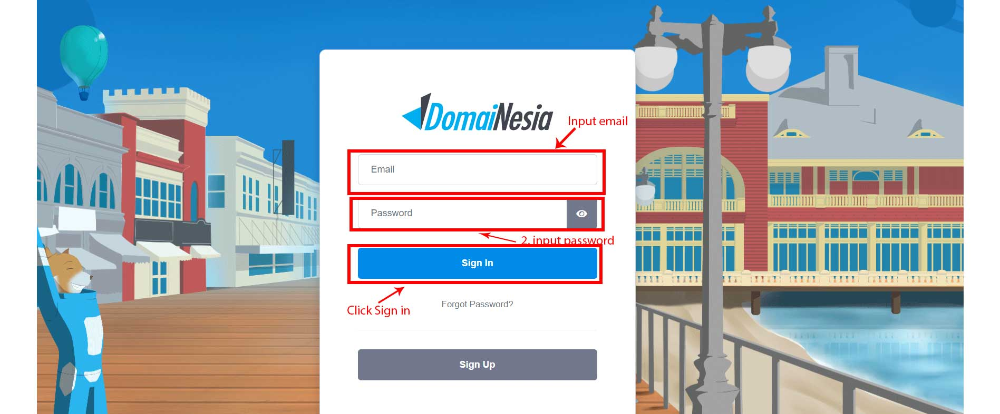

3. Dashboard Domainesia
   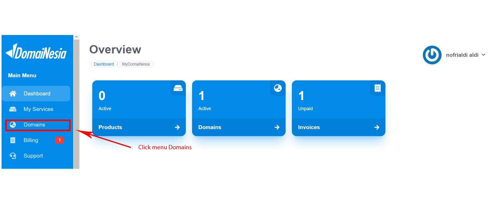

4. Domain page
   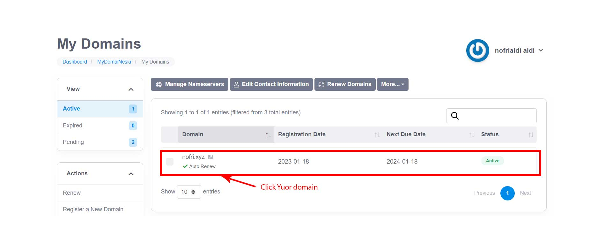

5. Managing Domain
   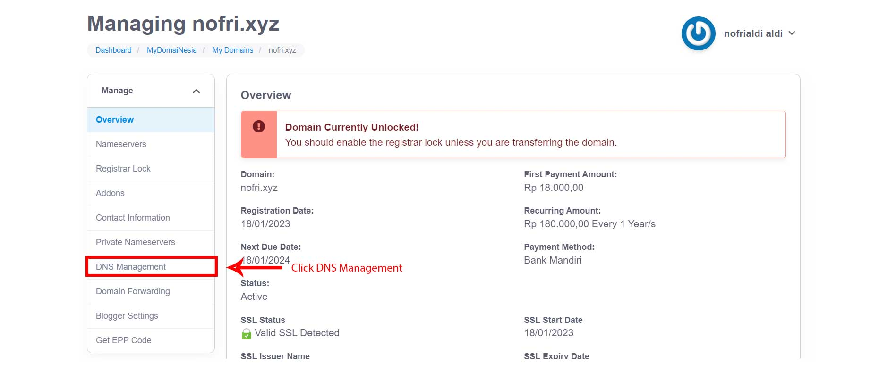

6. DNS Management
   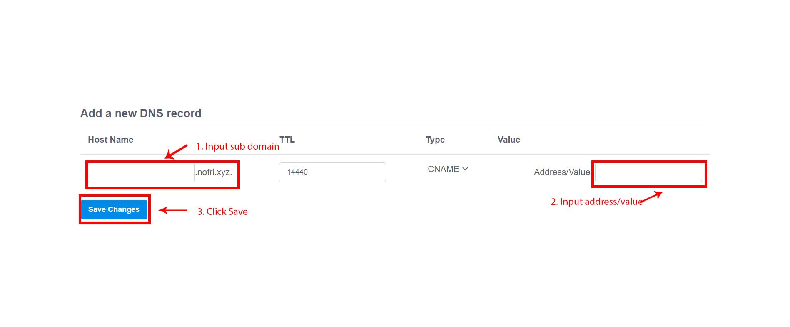

7. Add custom domain (Netlify)
   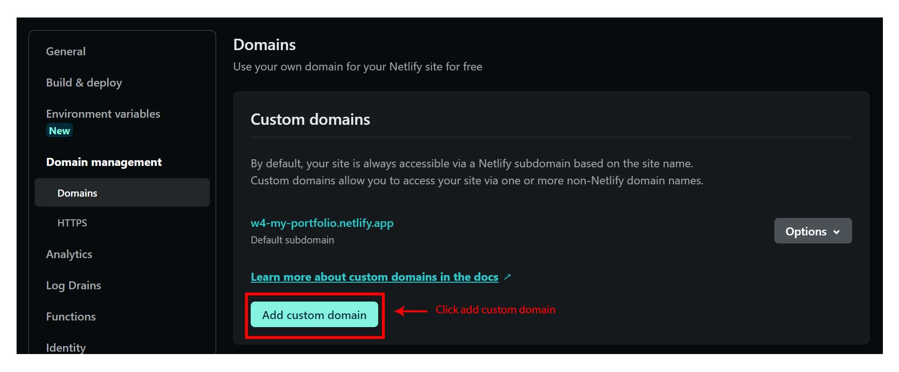

8. Input custom domain/subdomain
   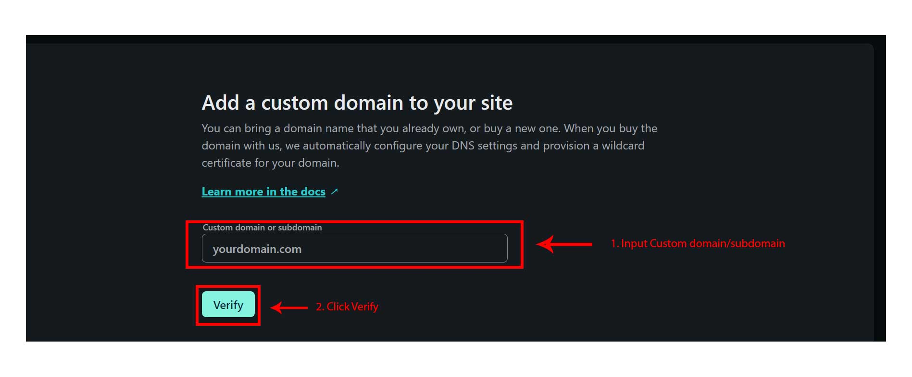
   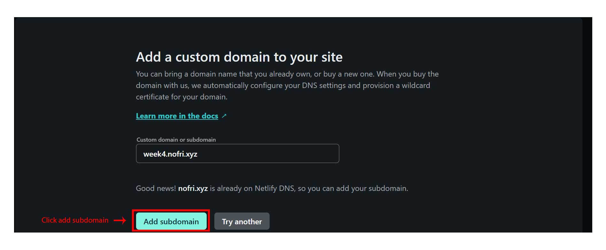

9. DNS configurasi
   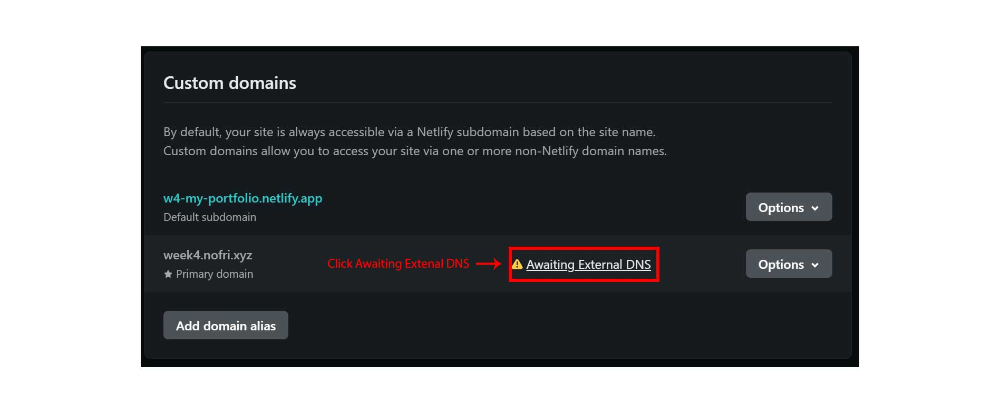
   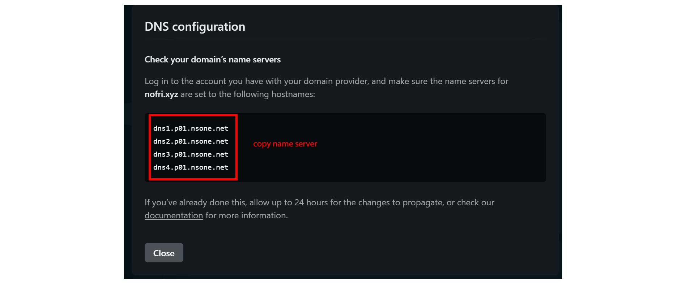
   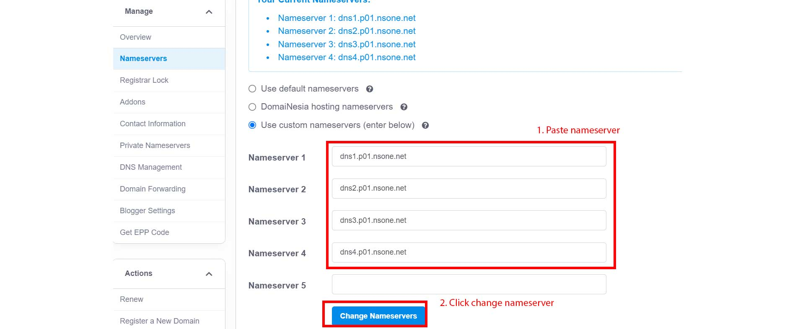

</main>

