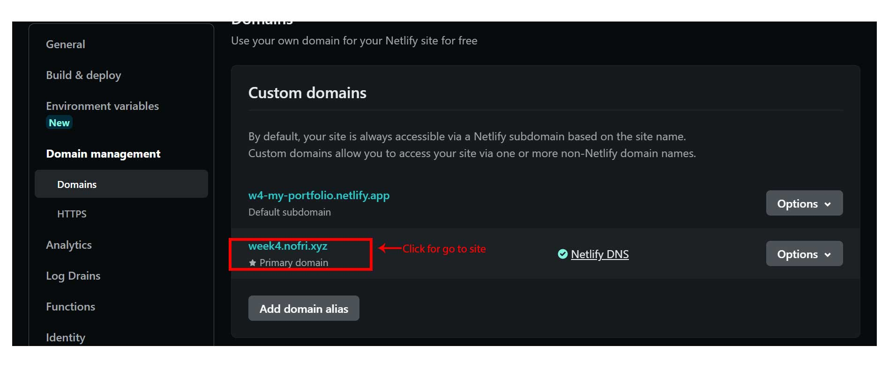
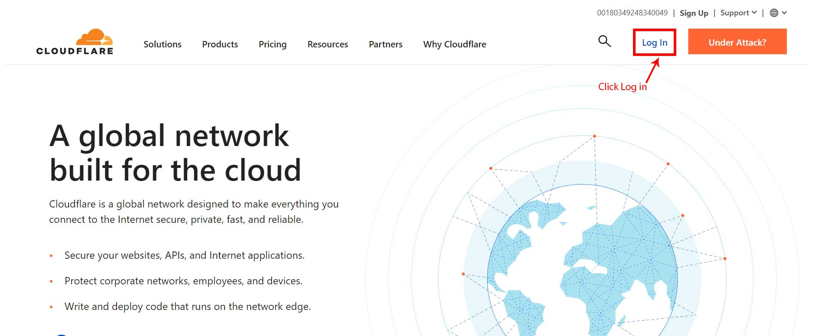
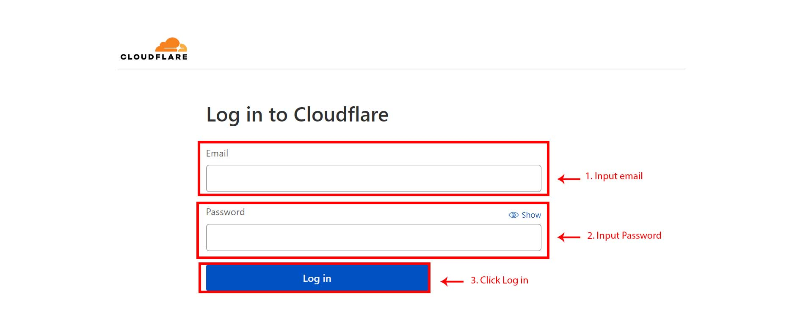
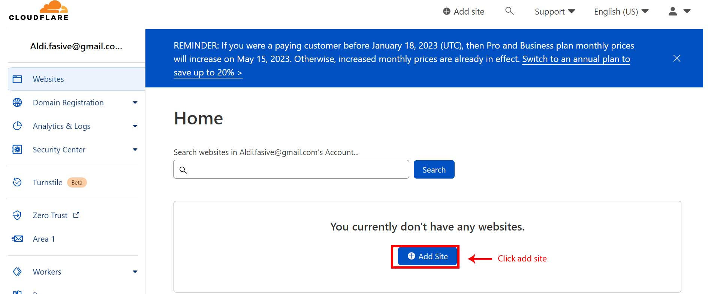
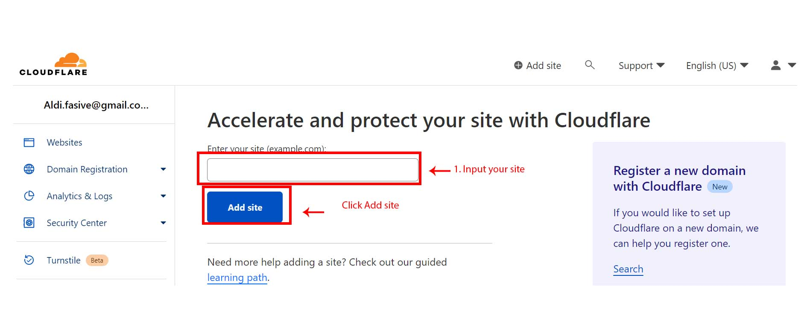
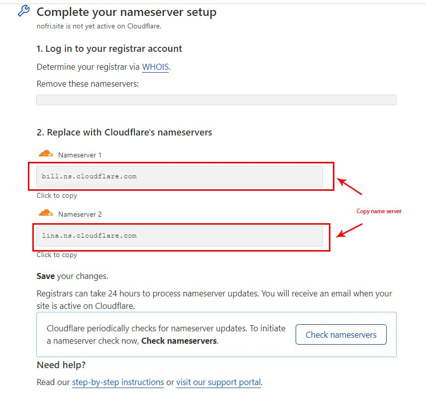
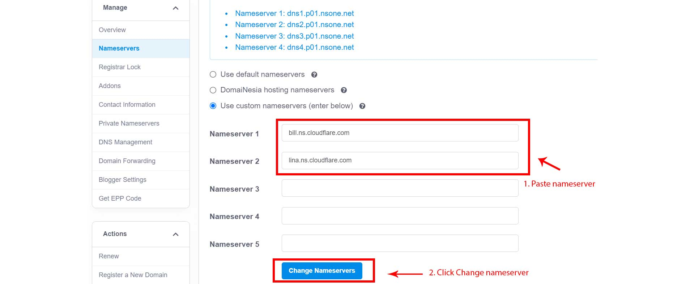

# My Portfolio

> Assignment for My Portfolio

This is a simple personal website of **Nofrialdi** made using HTML and CSS.

## Links/URLs

1. Link Github Pages :<https://revou-fsse-1.github.io/w4-my-portfolio-nofrialdi/>
2. Link Netlify : <https://w4-my-portfolio.netlify.app/>
3. Link Domainersia :<https://week4.nofri.xyz/>

## Documentation

  
Deploy project to Netlify

<main class="content">
  
The first step is to open the netlify.com website in the browser, then click Sign up as shown below:

after clicking the sign up button on the main page, a sign up page will appear and there are several ways to create a netlify account, such as signing up using github, gitlab, bitbucket and email. in this documentation I signed up using a github account so I clicked the github button to sign up using a github account

The next step is to input your GitHub account email and password, then click the sign up button

the next step on the dashboard page click add new site to add a website when you click the add new site button, several sub menus will select import an existing project

after that on connect to git provider select the github button

after that select the repository where the website that we will deploy

after that click the deploy site button

then to set up the domain name or site we can click the domain settings button

then on the custom domain click the options button then click edit site name

after that, input the site name if you have clicked the save button

after that click the website link that we created earlier to display our website

</main>

  
Custom domain using DomaiNesia

<main class="content">
  
The first step in our browser is to open domainesia.com and click the sign in button on the main page

after that input your email and password if you have clicked the sign in button

on the main menu click the domain menu

then click the domain that we registered earlier

after that click dns management

after that input the subdomain and add the address value using the web link that we deployed using netlify earlier then click the save change button

the next step is to return to netlify and click the domain setting button and click add custom domain

then input the domain that we created earlier in domainesia

after that click awaiting external dns

then copy nameservers

then return to domainesia and paste the name server that we copied earlier if you have clicked the change nameserver button

then click back to netlify and click on the domain that we created earlier, the web page that we created will appear

</main>

<!-- 

  
Custom domain using Cloudflare

<main class="content">

1. Open Cloudflare.com
   

2. Login Cloudflare
   

3. Add Site
   

4. Input site
   
   .jpg>)

5. Copy nameserver
   
   

</main>

 -->
